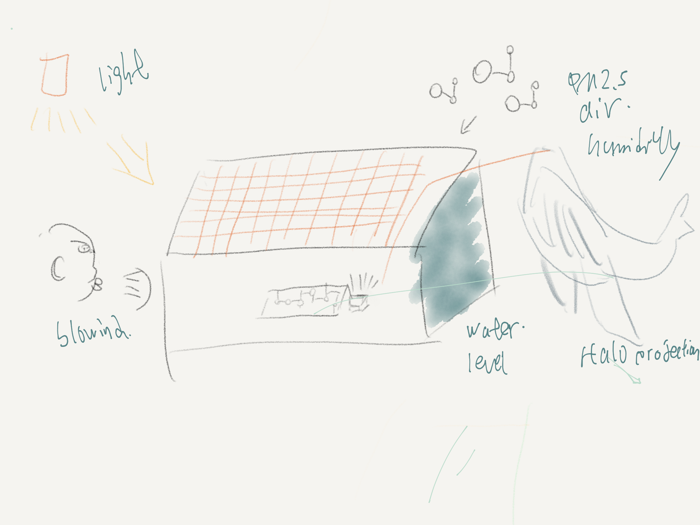
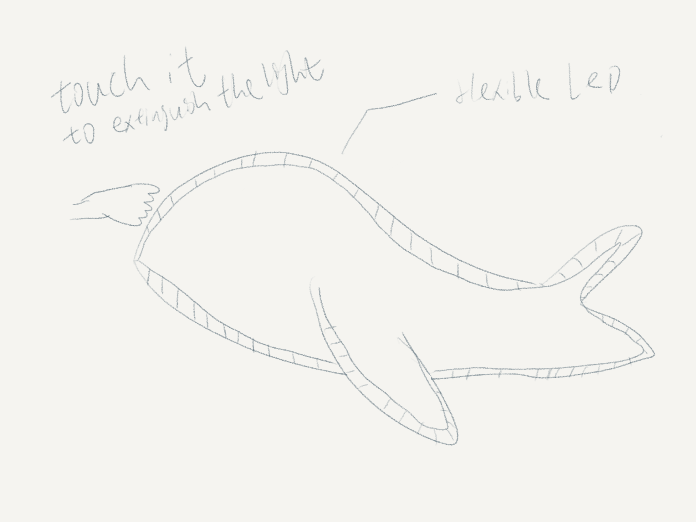
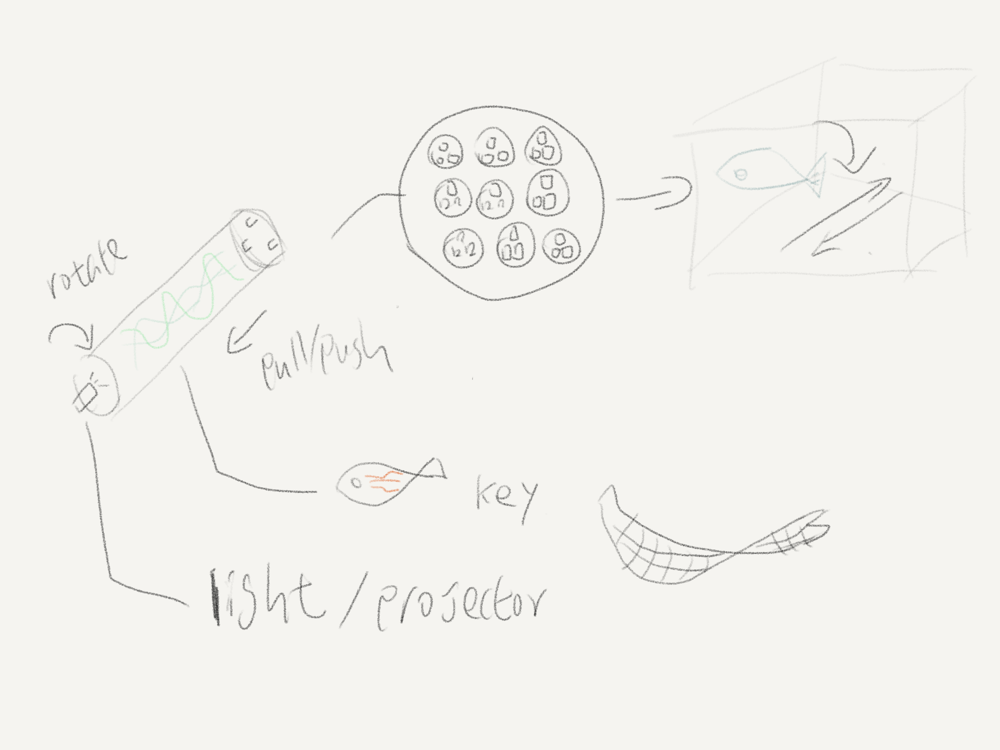
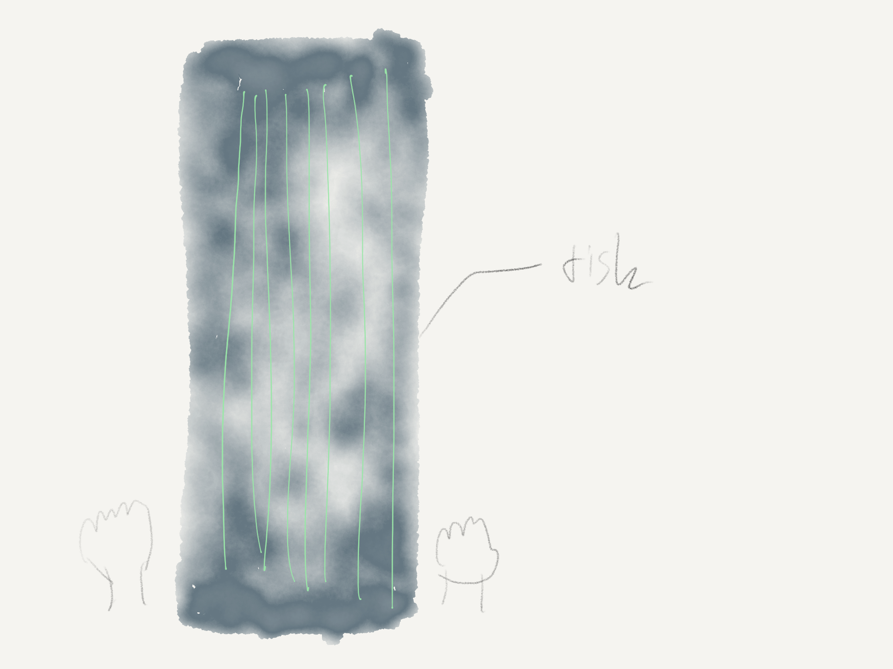
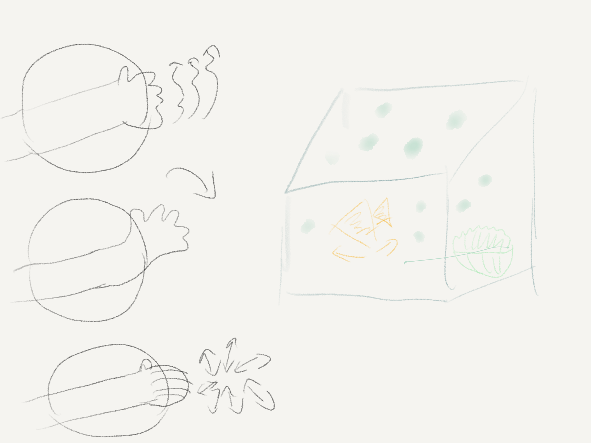
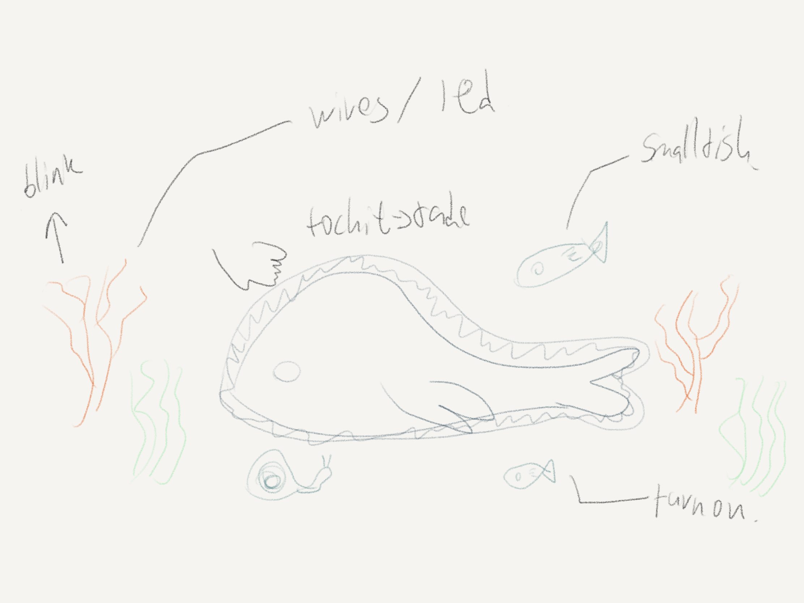
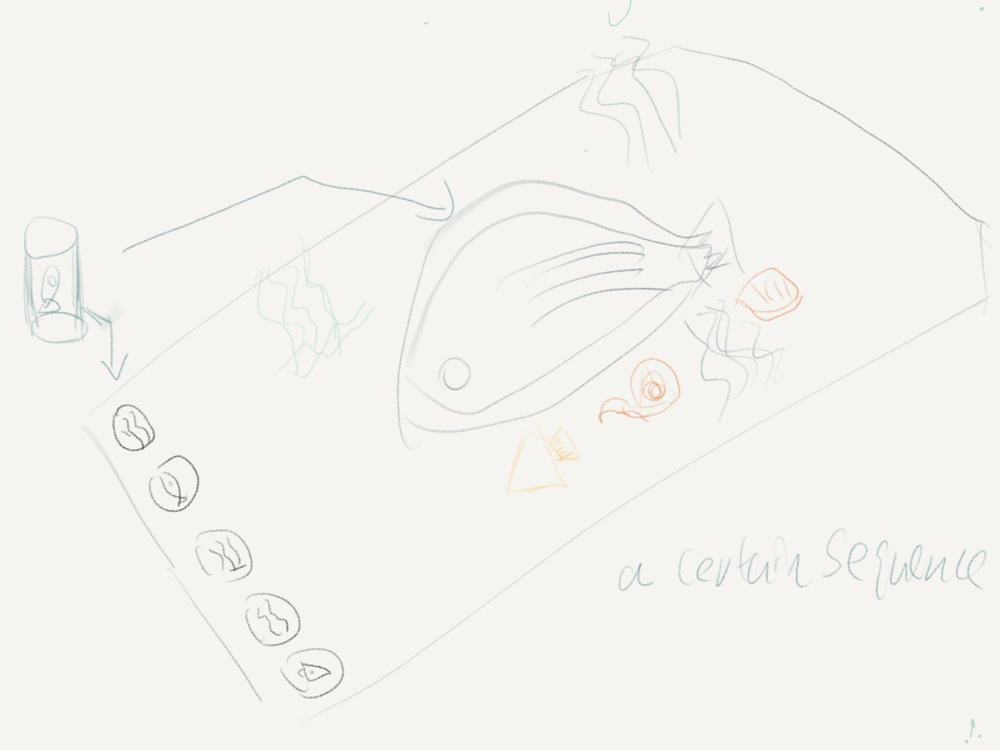

# final project record
#日程 #important
2019年11月3日 下午7:35 week01
## reference
### concept reference
- [Quand les hamsters régnaient sur la terre – Shake That Button](https://shakethatbutton.com/quand-les-hamsters-regnaient-sur-la-terre/)
- [Geobio – Shake That Button](https://shakethatbutton.com/geobio/)
- [Anachronic Landscapes – Automation and coevolution in nature / @curimebatliner](https://www.creativeapplications.net/robotics/anachronic-landscapes-automation-and-coevolution-in-nature/)
- [Whale - Generative music and art project about the sea](http://generativo.es/whale/en/)
- ([The Carp and the Seagull - Interactive short film by Evan Boehm (@evanbbb) + @nexuslondon](https://www.creativeapplications.net/featured/the-carp-and-the-seagull-interactive-short-film-by-evan-boehm/))(vision)
- [Christoph Labacher · Interaction Design Student · Cousteau](https://christophlabacher.com/cousteau)(vision)
- [2019 的 MLF designed, directed and produced the video for McLaren’s P1 launch:  long exposure photography light painting … | R Numeric, Digital and TRON-like 主题](https://www.pinterest.se/pin/555983516479448701/)(vision & output)
- [Beatoven by @viktography - Mixing sounds as if they were cooking ingredients](https://www.creativeapplications.net/arduino-2/beatoven-mixing-sounds-as-if-they-were-cooking-ingredients/)
- [The Deep Sea - Interactive Installation](https://ocean.si.edu/ecosystems/deep-sea/when-art-meets-science-exhibition-inspired-bioluminescence) (the steering wheel is interesting)
- [When Art Meets Science: Exhibition Inspired by Bioluminescence | Smithsonian Ocean](https://ocean.si.edu/ecosystems/deep-sea/when-art-meets-science-exhibition-inspired-bioluminescence)
- [Vanitas Machine - The transience and extension of life](https://www.creativeapplications.net/objects/vanitas-machine/)
- [Nebula (interactieve muur van NYOYN) op KindVak 2009 - YouTube](https://www.youtube.com/watch?v=NRM9w4PNXHk&feature=share)(the interactive way)
- [Japan, as a country surrounded by mountains and the sea, undergoes many changes with the passing of the four seasons. Rivers go through … | Techno Room](https://www.pinterest.se/pin/160440805460918542/)
- [Japan, as a country surrounded by mountains and the sea, undergoes many changes with the passing of the four seasons. Rivers go through … | Techno Room](https://www.pinterest.se/pin/160440805460918542/)
- [2019 的 Wow this one made me cry!!! Interactive Zebrafish Donor Wall - imagining something with GA ripples going out out out from each donor … | exhibit design 主题](https://www.pinterest.se/pin/463941199105400293/)
- [Doug Aitken creates an aquatic installation in California | Wallpaper*](https://www.wallpaper.com/art/doug-aitken-and-parley-for-the-oceans-take-art-under-the-sea)
- [Alt-C – Designing for synergy between our ecosystems and network economics](https://www.creativeapplications.net/vvvv/alt-c-designing-for-synergy-between-our-ecosystems-and-network-economics/)(cool!!!!!)
- [Underwater by David Bowen - Hundreds of servos controlling wave patterns](https://www.creativeapplications.net/processing/underwater-by-david-bowen-hundreds-of-servos-controlling-wave-patterns/)
- [Our Time – Spatial instrument for manipulating perception of time – @UVA_Studio‬](https://www.creativeapplications.net/environment/our-time-spatial-instrument-for-manipulating-the-perception-of-time/)
- [The Emergence and Decay of Computation on Vimeo](https://vimeo.com/336939272) / [SFPC Spring 2019 Student Showcase / @sfpc / by Celine Wong Katzman & @tchoi8](https://www.creativeapplications.net/maxmsp/sfpc-spring-2019-student-showcase/)
- [Season in Review - iPad as Interactive Data Sculpture / by @tllabs](https://www.creativeapplications.net/membersonly/season-in-review-ipad-as-interactive-data-sculpture/)
- [Drone Garden by @artsci_berlin - Network bandwidth as a resource for survival](https://www.creativeapplications.net/environment/drone-garden/)
- [Pixi – Nature aware, self-sufficient, digital organism ‘breathes’ in the forest / @werccollective](https://www.creativeapplications.net/environment/pixi-nature-aware-self-sufficient-digital-organism-breathes-in-the-forest/)
- [Pour Reception – Water as a digital (material) interface / @toreknudsn](https://www.creativeapplications.net/processing/pour-reception-water-as-a-digital-material-interface/)(how the water interact)
- [Plasmosis | Sofian Audry](https://sofianaudry.com/en/works/plasmosis)
- [The Immortal by Revital Cohen - Life-support machines modified to 'breathe' in a closed circuit](https://www.creativeapplications.net/events/the-immortal-life-support-machines-modified-to-breathe-in-a-closed-circuit/)
- [Floral Automaton – Digital growth with physical adaptation / @thomgrog](https://www.creativeapplications.net/arduino-2/floral-automaton-digital-growth-with-physical-adaptation/)
- [Botanicus Interacticus - Designing interactive plants at Disney Research](https://www.creativeapplications.net/other/botanicus-interacticus-designing-interactive-plants-at-disney-research/)
- - - -
### material & technique reference
- [How to Build a Companion Cube Mood Lamp (For Absolute Arduino Beginners)](https://www.makeuseof.com/tag/build-companion-cube-mood-lamp/)
- [Paper Circuit! - YouTube](https://www.youtube.com/watch?v=BwKQ9Idq9FM)
- [APDS-9960 RGB and Gesture Sensor Hookup Guide - learn.sparkfun.com](https://learn.sparkfun.com/tutorials/apds-9960-rgb-and-gesture-sensor-hookup-guide/all)
- [Ori and the Blind Forest: Shrouded Lantern With RBG LEDs and Bluetooth Control: 6 Steps (with Pictures)](https://www.instructables.com/id/Ori-and-the-Blind-Forest-Shrouded-Lantern-With-RBG/)
- [How to Make Conductive Play Dough.: 3 Steps (with Pictures)](https://www.instructables.com/id/How-to-make-conductive-play-dough/)
- [Say Hello to Dough Universe from Tech Will Save Us - YouTube](https://www.youtube.com/watch?v=8linqvrZIiI)
- [How  to Make Conductive Playdough - dArtofScience - YouTube](https://www.youtube.com/watch?v=_vge4vol868)
- [10块钱做一个全息投影仪？国外这位技术派大神做到了！_投影DIY](https://www.sohu.com/a/257179012_100256669)
- [SensorTape – 3D-aware dense sensor network on a tape](https://www.creativeapplications.net/processing/sensortape-3d-aware-dense-sensor-network-on-a-tape/)
- [Dough Universe: Teach kids about electronics with play dough by Technology Will Save Us — Kickstarter](https://www.kickstarter.com/projects/techwillsaveus/dough-universe-squishy-tech-toys-for-4-7-year-olds)
- - - -
## interactive input & output
### input
- clay
- gesture
- ~~~light~~~
- ~~~humidity~~~
- water level
- touch
- - - -
### output
- LED(shape)
- Buzzer(make sound)
- screen
- wires(LED)
- Move(the “creature”)(physical way or digital way?)
- - - -
## sketch

(Previous one) 

(One way interact with the "whale”) 

(Input the “creature”) 

(Fish group) 

(One way to control the "creature”) 

(How the installation looks like) 

(Recent version 2019年11月3日 下午9:28 ) 
- - - -
## concept
[Whale fall](https://en.wikipedia.org/wiki/Whale_fall) is an important and special system in the deep sea. 
It represent a lot of things, like the death and life, the rebirth, the relationship of different creatures, the energy transformation in a dynamic system,  how the time pass(the whale fall will last for about a hundred year generally). 
The recent version would more focus on how people interact with the “creature”, let them feel and touch the installation, to understand how this system operate. 
Audience firstly input a shape they created, put it into a cylinder, then insert it into the installation. 
The shape they make would output the image on the screen/or **other form to output**. 
The other interactive way is by using the gesture detection to control the “creature” , like making a fist to control the “shell”, or swing hands to swimming the fishes. 
For building a atmosphere of the deep sea, the Buzzer will output some echo sounds, base on the water level(you need to put the clay into the water). This represent that actually we can’t see anything in the deep sea as there is no light penetrate in it. But we still can hear sound(of course we can see the image in the installation, but in reality no.), the higher of the water level, means more “creatures”(clay) in the sea, so that the more sound will be output. 
- - - -
### Thinking
1. As for the output , except the screen are there some other way to built the scenes. Like using the pipe to wave a whale and other creature? But if using the pipe, so how can the clay also join into the same scenes.
2. What if remove all the concretization stuff, just remain the electric components to build a cyberpunk scenes? Like a metal whale? As actually the whale fall is a kind of energy transformation, this also happened in electric system, or the robot world.
3. Another way to interact is building the fake fishes, embodied different sensor, let the fake fishes interact with the dead whale. Like building a real “electric” bio system. 	

