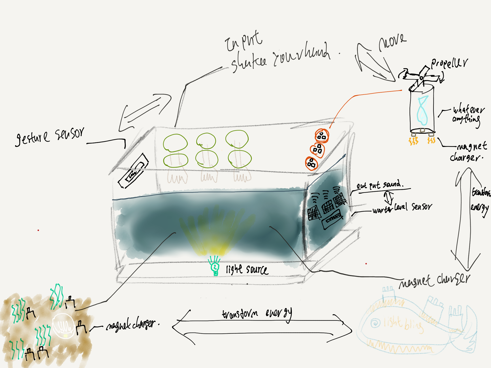
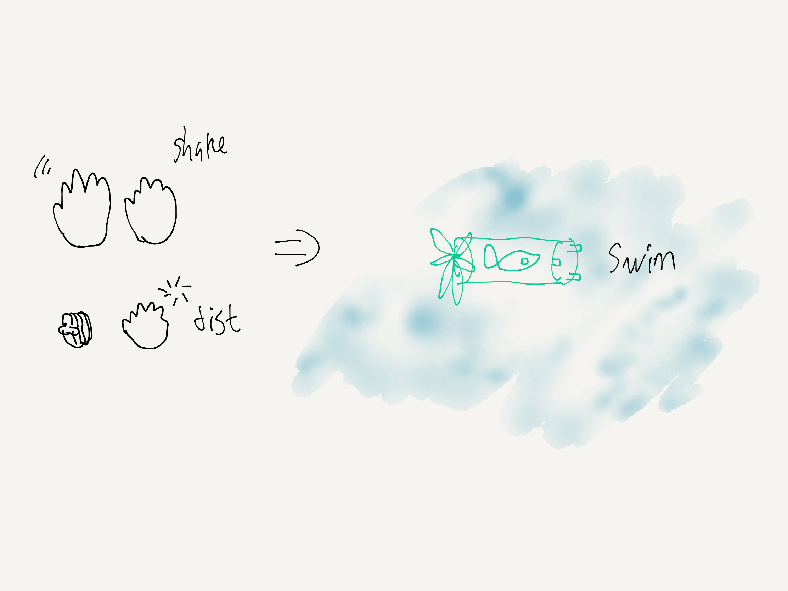

# week02

## version 1.0

(version1.0)
### concept
Continue the progress “**Thinking**” of week01, I came up the second one. This is the scene.
The concept is, what if our world is consist of robot or the mechanical stuffs? 
How they get the energy from the environment? 
Will they act like a real creature to prey others’s resource? 
If they have a hierarchy, how the energy(“resource) transform to each class?
How the environment will effect the creatures (including the robots) gain the energy to survive?
There are a lot of things.
Of course the prototype is the reference of the **whale fall**, as this is a quite interesting and classical model of the energy transformation.
The reason i pick the second one is, at first I want to build a box to let people feel and touch how a whale fall looks like and how it operate. But later I realized that if I want to build something very specific, or has a certain “shape” or “form”, it would be hard to make it looks lifelike. 
On the other hand,  if I make something can inspire or motivate people’s imagination, that would be more educational meaning and capacity more inside thinking.
### How it work
Basically, its quite similar with the version_beta. The audience will use their hand to control the “fishes” to swim in under the water. The difference is, now they have a **”task”**: to “suck” or charge the energy from the “dead whale”, then transform the energy to other creatures like the sea grasses or the soil. 
At beta, people can make some clay as an input, which mean they can control their own creatures.
At 1.0 this input been cancelled. There two reason:
1. I am not sure can the clay word normally under the water, if it can, I will be happy to use them as a protection to the wires.
2. As the concept changed, I wanna build a cyberpunk style scene, I think clay is a little bit not suitable to this style.
- - - -
### input&output
**Input:**
- gesture
- water level
- magnet
**Output:**
- movement(propell push the fishes move under the warter)
- sound(out put the sound from the deep sea)
- light (light on when the fishes prey the energy(current) from the whale, also happened at any energy transform process/)
- - - -
Flow chart:

- - - -
## schedule
- week01- cameup the idea and sketch
- week02 - modify and buy tools, components, sensors.
- week03 - test the **gesture detection**  build a prototype, and test the **water level**
- week04 - test the how to control the **propeller** and let it **move under the water**
- week05 - test how to **use magnet to turn on the light** (or how to use the magnet to charge the capacitor to turn on the light, I think this on would be much harder)
- week06 - **combine them together** to make a independent system
- week07 - final test(leak problems)
- - - -
## shopping list
The most excited part XD.
- [ ] MCU
- [ ] gesture detect sensors
- [ ] LED
- [ ] tank
- [ ] empty bottle
- [ ] propeller
- [ ] water level sensors
- [ ] wires, switch, etc…

