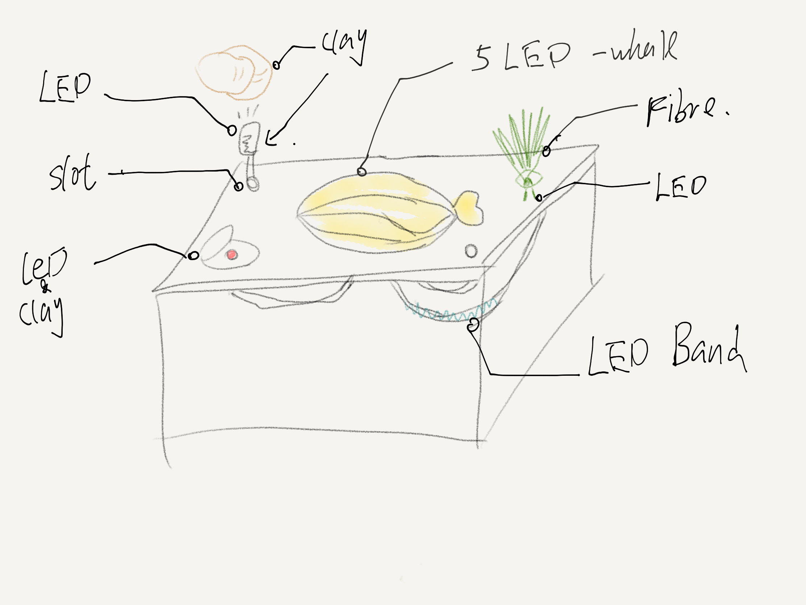

# week03

## Version2.0

The basic concepet will inherit the week02’s main content. As the “under warter” project too hard to achieve, but I want to remain the idea of showing the “energy transformation”, so on this project I removed the water, but the installation still remain two layer.  The second layer will use the led band to show how the energy transform from the “whale” to the environment.
Also the project gonna reuse the clay as another input as there was no senses to use the gesture to control the “submarine”.  
The installation will set two slot allowing the audience to put the shape they like on it, then as the clay allow the circuit pass by, then the LED and the LED band under the slot would be light on. 

- - - -
## shopping list
- [x] Hall effect sensor
- [x] MCU
- [ ] ~~~gesture detect sensors~~~
- [x] LED
- [x] tank
- [ ] ~~~empty bottle~~~
- [ ] ~~~propeller~~~
- [ ] ~~~water level sensors~~~
- [x] wires, switch, etc…
- [x] LED BAND
- [ ] 3pin transistor
- [x] capacitor
- - - -
## task
- build the minmum basic model(test)
- build the whale consist of LED(pipe)
- make the conductive clay
- combine everything together

