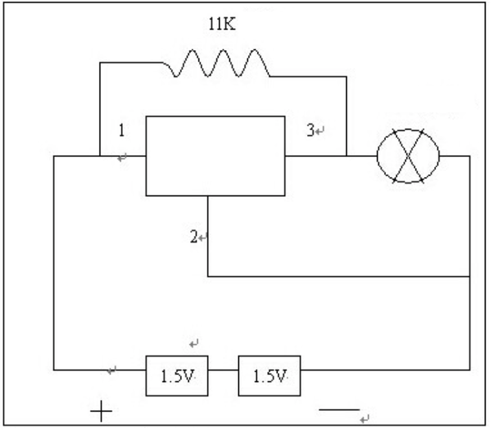
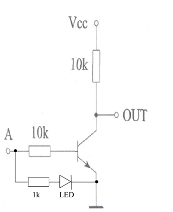

# week05

Date: Dec 07, 2019
Tags: done

## basic model

This week i built the basic model, refer to use the hall effect sensor to turn off one LED while the other on.

## HALL EFFECT SENSOR

The first thing i needed to build was the hall effect sensor to turn off the LED, which make me use the magnet to control the LED.

There many model of the hall effect sensor. You can used the linear hall effect sensor to detect how strong the magnet, or use the switch hall effect sensor to as a speed calculator.

Also, the switch hall effect sensor have two different type, one is the latching while the other is non-latching.

The latching mean when you turn it on, it will keep the status until  you change it again. The non-latching mean when you move away the magnet, the status will back the previous.

I used the latching hall effect sensor here because once the "energy transform" start, the process can not be reverse.

I used the model US1881 here. Here is how it working.

The resistor value depends on how easy the LED can be light up.

When the hall effect sensor detect the magnet, the digital out will out put high voltage, then the LED will be turn off as now the current going from pin1 to pin2.
some hall effect sensor using guide: [HALL EFFECT SENSOR](https://maker.pro/arduino/tutorial/how-to-use-a-hall-effect-sensor-with-arduino)
## NOT GATE

To get there, i built the NOT GATE.

As we know that in the CPU, there are many many many Triode formed the whole CPU, because the feature, the Triode can make the AND GATE, OR GATE, and the NOT GATE. This 3 basic logic gate make the CPU can calculate the 0101010101 and other operation. So my task was to built a very large NOT GATE(because the elements in the CPU are super mini.)

Here is the schematic how to use a NPN transistor to build a NOT GATE.

Made the LED parallel with the NPN transistor, the BASE connect to the voltage you want to read. Here i connect to the LED of the hall effect sensor.

Because the hall effect sensor will going from PIN1 to PIN2, which mean low voltage at the LED, so when the NPN transistor detect the low voltage from the LED, the LED at NPN PART will turn on, as we are building a NOT GATE , the result is in contrast.

## COMBINE TOGETHER

Here is the how it work together:

[NOT GATE AND HALL EFFECT SENSOR](https://vimeo.com/user92504253/review/385122551/b3411e069e)

## NEXT STEP:

So far i succeed in building a basic control model. The next step is to build another output, the buzzer and the conductive clay.
